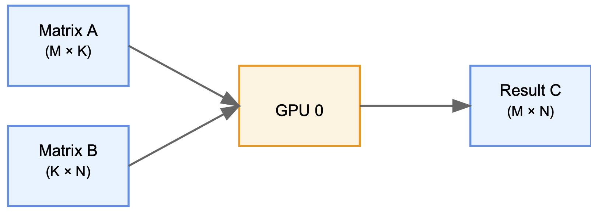

Scaling Matrix Multiplication Across Multiple AMD GPUs with RCCL and rocBLAS
============================================================================

.. admonition:: Highlights

 Scaling matrix multiplication beyond a single GPU presents both opportunities and challenges in deep learning. This blog post demonstrates how to scale our `previous single-GPU implementation <https://blog.pebblesandweeds.com/gpu_matmul_blog.html>`_ to efficiently utilize multiple GPUs in a single server through AMD's RCCL library, showing how coordination of communication and computation can achieve near-linear performance scaling.

 - **Scaling Efficiency**: We achieved 93.75% of the theoretical maximum throughput across 8 AMD MI250x GPUs, processing at 278.4 TFLOPS compared to the ideal 300 TFLOPS (8 × ~37.5 TFLOPS). Each GPU executes ``rocblas_sgemm()`` for its local matrix multiplication while coordinating through RCCL, delivering a 7.5x speedup from a single GPU - approaching but not quite reaching perfect 8x scaling due to communication overhead.

 - **Memory Distribution**: We performed multiplication of 32,768 x 32,768 single precision matrices by horizontally chunking matrix A across eight (8) GPUs while broadcasting matrix B. This reduces per-GPU memory requirements from 12.87 GB to ~5.36 GB while enabling parallel computation of the results.

 - **RCCL Communication**: Implemented single-host, multi-GPU coordination through RCCL collective operations, broadcasting matrix B across GPUs and combining partial results through allGather. These high-level primitives handle the complex low-level details of efficient inter-GPU data transfer.

 - **PyTorch Validation**: Implemented simple distributed `Pytorch <https://github.com/pebblesandweeds/rccl_gpu_matmul/blob/dev/pytorch/pytorch_rccl.py>`_ code using torch.distributed primitives that achieved matching multi-GPU performance (~279.2 TFLOPS), validating our low-level C and RCCL implementation against PyTorch's established distributed computing framework.

 This implementation demonstrates how proper coordination between RCCL communication and rocBLAS computation enables efficient scaling across multiple GPUs while maintaining high performance. Our C implementation provides insight into distributed GPU computing concepts while achieving performance parity with PyTorch's optimized framework.

Introduction
------------

In our `previous blog post <https://blog.pebblesandweeds.com/gpu_matmul_blog.html>`_, we implemented matrix multiplication in C using AMD's `rocBLAS <https://rocm.docs.amd.com/projects/rocBLAS/en/latest/>`_ library, specifically utilizing the `rocblas_sgemm <https://rocm.docs.amd.com/projects/rocBLAS/en/latest/reference/level-3.html#rocblas-xgemm-batched-strided-batched>`_ API to leverage AMD's fast GPU `matrix cores <https://www.amd.com/en/technologies/cdna.html>`_. The implementation demonstrated that carefully written C code using rocBLAS could match PyTorch's highly optimized matrix operations, allowing us to achieve the same performance with a lower-level implementation.

While our previous work focused on single-GPU matrix multiplication, this operation is inherently parallelizable - computations can be efficiently distributed across multiple GPUs with minimal dependencies between parallel tasks. Modern servers and supercomputers systems support this parallelism by providing multiple GPUs per node, enabling significant computational speedups through parallel execution. While our `single-GPU implementation <https://github.com/pebblesandweeds/gpu_matmul>`_ demonstrated basic rocBLAS capabilities, the parallel nature of matrix multiplication makes it an ideal candidate for multi-GPU execution.

This post extends our previous work by distributing matrix multiplication across multiple GPUs within a single host using `RCCL <https://github.com/ROCmSoftwarePlatform/rccl>`_ (ROCm Communication Collectives Library). `RCCL provides <https://rocm.docs.amd.com/projects/rccl/en/latest/>`_ efficient communication primitives between GPUs, similar to NVIDIA's NCCL, enabling us to coordinate computation across all available devices to maximize hardware utilization and computational throughput. Our goal is to show how to extend our single-GPU rocBLAS implementation in C to utilize RCCL for coordinating matrix multiplication across multiple GPUs in a single host system.

Scaling Matrix Multiplication: From Single to Multi-GPU Systems
----------------------------------------------------------------

Single-GPU Matrix Multiplication
^^^^^^^^^^^^^^^^^^^^^^^^^^^^^^^^
The rocBLAS ``rocblas_sgemm`` API implements high-performance single precision (fp32) matrix multiplication using AMD's matrix core accelerators (detailed formula and optimizations are covered in our `previous post <https://blog.pebblesandweeds.com/gpu_matmul_blog.html#matrix-multiplication-formulas>`_). The core workflow involves transferring input matrices A and B to GPU memory, executing the multiplication, and transferring result matrix C back to host memory.

While this appears straightforward, achieving peak performance requires careful orchestration of memory transfers, matrix layouts, and compute scheduling. Thankfully, rocBLAS abstracts away many of these complexities - it handles matrix padding and alignment to maximize memory throughput, manages optimal blocking strategies for AMD's matrix cores, and provides batching capabilities for efficient execution of multiple multiplications. This allows developers to focus on high-level algorithm design while the library manages the hardware-specific optimizations.

Even though this single-GPU approach delivers good performance for matrices that fit within GPU memory, it is ultimately constrained by both memory capacity and computational throughput of a single device. A modern GPU can deliver impressive TFLOP/s for matrix operations, but most AI workloads demand higher computational capabilities than a single GPU can deliver. These performance demands, combined with memory limitations, motivate exploration of multi-GPU approaches that can harness both the aggregate compute power and memory capacity of multiple devices.

  Simple matrix multiplication on single GPU

Distributed Matrix Multiplication 
^^^^^^^^^^^^^^^^^^^^^^^^^^^^^^^^^

Extending beyond a single device, we can leverage multiple GPUs within a host system to dramatically increase both computational throughput and available memory. The key lies in efficiently partitioning the workload while minimizing data transfers between devices.

Our distributed implementation employs a horizontal partitioning strategy that balances computational efficiency with communication overhead through several key mechanisms:

* **Matrix Distribution** - Matrix A is split horizontally across GPUs while matrix B is broadcast in its entirety to each device using RCCL, allowing independent processing of matrix partitions using rocBLAS primitives.

* **Result Consolidation**: The system combines partial results from each device through RCCL's allGather operation, constructing the final output matrix

* **Performance Optimization**: The approach maximizes efficiency through balanced computational load from the horizontal split of A, minimizing inter-GPU communication through a single broadcast of B, and requiring only one collective operation during result collection via allGather

Through these design choices, we transform our earlier single-GPU implementation into a scalable distributed system that preserves the computational efficiency of rocBLAS while extending across multiple devices.

.. figure:: _static/matmul_rccl_workflow.png
   :alt: Distributed Matrix Multiplication Workflow
   :align: center

   Distributed matrix multiplication across multiple GPUs

Broadcasting matrix B instead of partitioning it optimizes our approach for deep learning workloads. While this requires more memory per GPU, it significantly reduces communication overhead based on how matrices A and B are used in practice:

* Matrix B contains model weights that remain constant across many computations
* Matrix A holds the activations or embeddings that change with each forward pass
* Matrix multiplication requires each row of A to interact with every column of B. Partitioning B by columns would force GPUs to exchange partial results, since computing a single output row needs access to all of B's columns

Given modern GPU memory capacities and the characteristic reuse of parameter matrices in deep learning workloads, the higher memory cost of broadcasting B is outweighed by the reduced communication overhead.

Implementing Multi-GPU Matrix Multiplication
--------------------------------------------

Implementation Libraries 
^^^^^^^^^^^^^^^^^^^^^^^^
Our implementation leverages two core AMD libraries:

**rocBLAS for Matrix Computation**

The `rocblas_sgemm` function handles the actual matrix multiplication on each GPU. After receiving its chunk of matrix A and complete copy of matrix B, each GPU executes a standard matrix multiplication operation. rocBLAS automatically optimizes this computation for AMD's matrix cores, managing internal memory layouts and compute scheduling.

**RCCL for GPU Communication**

RCCL (ROCm Communication Collectives Library) provides efficient primitives for moving data between GPUs. While this is AMD's library, it maintains API compatibility with NVIDIA's NCCL - hence the `nccl` prefix in function names like `ncclBroadcast`. Our implementation uses two key RCCL operations:

* ``ncclBroadcast`` distributes matrix B to all GPUs during initialization
* ``ncclAllGather`` combines partial results from each GPU's computation into the final output matrix

RCCL handles the complexity of optimal data transfer paths between GPUs, utilizing direct GPU-to-GPU communication when available and automatically selecting the most efficient transfer methods based on system topology.

The interaction between these libraries follows a clear pattern: RCCL first distributes the input data across devices, rocBLAS performs local computations on each GPU, and finally RCCL consolidates the results. This separation of concerns - RCCL for communication and rocBLAS for computation - allows each library to optimize its specific role while working together for efficient distributed processing.

Memory Requirements
^^^^^^^^^^^^^^^^^^^

Let's examine the memory distribution patterns across GPUs in our matrix multiplication implementation. For this discussion, we'll use 32K × 32K matrices with single precision floating point values (fp32, 4 bytes per element). Each complete matrix occupies:

.. math::

   32,768 \times 32,768 \times 4 \text{ bytes} \approx 4.29 \text{ GB}

While these matrices are modest in size for modern enterprise GPUs, they serve as an example for understanding the memory efficiency benefits of distributed computation.

**Single-GPU Memory Footprint**

When running matrix multiplication on a single GPU using rocBLAS (as covered in our previous blog post), we need all three matrices to reside in device memory. With each matrix requiring 4.29 GB, our total VRAM usage is ~12.87 GB for matrices A, B, and C. While this memory footprint is well within the capabilities of modern GPUs, by distributing these matrices across devices we can reduce the per-GPU memory requirements, paving the way for larger computations or processing multiple matrix multiplications in parallel.

**Distributed Memory Layout**

Our 8-GPU implementation reduces per-device memory usage through selective matrix distribution. Each GPU stores:

* 1/8th chunk of matrix A: 4.29 GB ÷ 8 ≈ 536 MB
* Complete copy of matrix B: 4.29 GB
* 1/8th chunk of output matrix C: 536 MB

This distribution strategy requires ~5.36 GB per GPU compared to the 12.87 GB needed for single-GPU execution. The reduction stems from dividing matrices A and C across devices while broadcasting B to each GPU. While in this example our memory savings are modest, this pattern becomes increasingly important when scaling to larger matrices or processing multiple matrix multiplications in parallel.

It's worth noting that in real-world deep learning applications, we typically process batches of matrix multiplications rather than single operations. While batched operations are beyond the scope of this blog post, the memory distribution strategy demonstrated here - chunking A and C while broadcasting B - provides an efficient foundation for handling these larger workloads.

RCCL Implementation Considerations
^^^^^^^^^^^^^^^^^^^^^^^^^^^^^^^^^^

When distributing matrix multiplication across multiple GPUs, several key factors influence overall system performance:

**Communication Overhead and Hardware**

While splitting computation across GPUs provides more aggregate compute power, it introduces communication overhead that must be managed carefully. The most significant communication costs occur during:

* Initial distribution of matrix chunks across devices
* Broadcasting matrix B to all GPUs
* Final gathering of results

The impact of these transfers depends on the system's GPU interconnect topology. Modern servers typically connect GPUs through PCIe (offering ~64GB/s bidirectional bandwidth) or vendor-specific interconnects like AMD's Infinity Fabric™ (providing higher bandwidth direct GPU-to-GPU communication). RCCL automatically selects optimal transfer paths based on the available hardware.

**Stream Management and Execution Flow**

Our implementation uses HIP streams to manage execution flow on each GPU. Streams provide essential mechanisms for:

* Queueing operations in the correct order
* Enabling asynchronous execution where possible
* Maintaining synchronization points between computation phases

While RCCL operations themselves are asynchronous, we ensure completion of each phase before proceeding to the next through explicit synchronization points. This careful orchestration of computation and communication enables our implementation to achieve near-linear speedup across multiple GPUs while maintaining numerical accuracy.

**Workload Distribution Strategy**

The size of matrix chunks assigned to each GPU presents a straightforward tradeoff:

* Larger chunks reduce the relative overhead of communication
* Smaller chunks provide more flexible load balancing

For our matrix multiplication case, we opted for simple equal-sized chunks since the computation is naturally balanced. This approach minimizes coordination overhead while maintaining good GPU utilization across devices.

Through this design, we minimize the overhead inherent in distributed computation while maximizing hardware utilization. The approach scales efficiently with additional GPUs while preserving the computational benefits of rocBLAS's optimized matrix operations on each device.

Code Walkthrough
^^^^^^^^^^^^^^^^^

Let's walk through the key components of our multi-GPU matrix multiplication implementation, examining how RCCL coordination, memory management, and computation work together to achieve high performance.

The first critical phase involves setting up the RCCL context and allocating memory across our GPU array. Each GPU needs its own chunk of matrix A, a full copy of matrix B, and space for its portion of the result matrix C:

.. code-block:: c

   // Initialize RCCL context
   RCCLContext* rccl_ctx = rccl_init(num_gpus);
   for (int i = 0; i < num_gpus; i++) {
       CHECK_HIP(hipSetDevice(i));
       CHECK_HIP(hipMalloc(&d_A_chunks[i], chunk_bytes));
       CHECK_HIP(hipMalloc(&d_B[i], full_size));
       CHECK_HIP(hipMalloc(&d_C_chunks[i], chunk_bytes));
       CHECK_HIP(hipMalloc(&d_C_final[i], full_size));
       // Copy data to devices
       CHECK_HIP(hipMemcpyAsync(d_A_chunks[i],
                               h_A + (i * chunk_size * N),
                               chunk_bytes,
                               hipMemcpyHostToDevice,
                               rccl_ctx->streams[i]));
   }

Once memory is allocated, the actual matrix multiplication operation is handled by rocBLAS, with each GPU working on its assigned chunk of matrix A while using the complete matrix B:

.. code-block:: c

   void perform_matrix_multiplication(
       rocblas_handle* handles,
       float** d_A_chunks,
       float** d_B,
       float** d_C_chunks,
       int N,
       int chunk_size,
       int num_gpus,
       hipStream_t* streams,
       int NUM_RUNS) {
       const float alpha = 1.0f;
       const float beta = 0.0f;
       for (int i = 0; i < num_gpus; i++) {
           CHECK_HIP(hipSetDevice(i));
           CHECK_ROCBLAS(rocblas_sgemm(handles[i],
                                      rocblas_operation_none,
                                      rocblas_operation_none,
                                      N, chunk_size, N,
                                      &alpha,
                                      d_B[i], N,
                                      d_A_chunks[i], N,
                                      &beta,
                                      d_C_chunks[i], N));
       }
   }

The RCCL library manages all communication between GPUs, first broadcasting matrix B to all devices and later gathering the partial results:

.. code-block:: c

   // Broadcast matrix B to all GPUs
   rccl_broadcast_matrix(rccl_ctx, d_B, N * N);
   rccl_sync_and_check(rccl_ctx);

   // After computation, gather results
   rccl_gather_matrix_chunks(rccl_ctx, d_C_chunks, d_C_final, chunk_size * N);
   rccl_sync_and_check(rccl_ctx);

To track performance across all GPUs, we use HIP events to measure computation time and calculate achieved TFLOPS for each device:

.. code-block:: c

   hipEvent_t starts[num_gpus], stops[num_gpus];
   for (int i = 0; i < num_gpus; i++) {
       CHECK_HIP(hipEventCreate(&starts[i]));
       CHECK_HIP(hipEventRecord(starts[i], streams[i]));
       // Perform computation
       CHECK_HIP(hipEventRecord(stops[i], streams[i]));
       float compute_time;
       CHECK_HIP(hipEventElapsedTime(&compute_time, starts[i], stops[i]));
       double tflops = (chunk_flops / (compute_time / 1000.0)) / 1e12;
       printf("GPU %d: Time: %.2f ms, Performance: %.2f TFLOPS\n",
              i, compute_time, tflops);
   }

This implementation demonstrates how proper coordination between RCCL communication and rocBLAS computation enables efficient scaling across multiple GPUs while maintaining the high performance we achieved in our single-GPU version.

Performance Analysis
--------------------

To validate our multi-GPU implementation, we conducted extensive performance testing comparing
our C implementation against a PyTorch reference. All tests were run on a system with 8 AMD
MI250X GPUs, processing 32,768 x 32,768 single-precision matrices requiring approximately
12.8 GB of total GPU memory. We executed 25 test runs to ensure consistent measurements.

For comparison, we implemented a simple PyTorch version using the distributed data parallel
features. The PyTorch code uses only about 50 lines to achieve the same functionality as our
C implementation - initializing the distributed process group, chunking the matrices across
GPUs, broadcasting matrix B, and coordinating the computation through NCCL (PyTorch's
interface to RCCL on AMD hardware). While our C implementation provides deeper insight into
the underlying mechanisms, the PyTorch version demonstrates how high-level frameworks can
abstract away much of the complexity of distributed GPU programming.

The detailed performance metrics demonstrate that our C implementation achieves performance
parity with PyTorch:

Benchmark Configuration
^^^^^^^^^^^^^^^^^^^^^^^
- Hardware: 8x AMD Instinct MI250X GPUs
- Matrix Dimensions: 32,768 x 32,768 (single precision, ~12.8 GB total memory)
- Number of Test Runs: 25

Performance Results
^^^^^^^^^^^^^^^^^^^
After initial warm-up, both implementations demonstrated nearly identical steady-state performance:

C Implementation:
- Average Performance per GPU: ~34.8 TFLOPS
- Aggregate System Performance: ~278.4 TFLOPS

Example steady-state output::

    GPU 2, Run 5: Time: 246.66 ms, Performance: 35.66 TFLOPS
    GPU 3, Run 5: Time: 247.72 ms, Performance: 35.51 TFLOPS
    GPU 6, Run 5: Time: 250.37 ms, Performance: 35.13 TFLOPS

PyTorch Implementation:
- Average Performance per GPU: ~34.9 TFLOPS
- Aggregate System Performance: ~279.2 TFLOPS

Example steady-state output::

    GPU 2, Run 5: Time: 245.72 ms, Performance: 35.80 TFLOPS
    GPU 3, Run 5: Time: 246.50 ms, Performance: 35.68 TFLOPS
    GPU 6, Run 5: Time: 249.80 ms, Performance: 35.21 TFLOPS

The results show that both implementations achieve nearly identical performance, with our C
implementation reaching ~278.4 TFLOPS compared to PyTorch's ~279.2 TFLOPS. This close match
validates the correctness and efficiency of our implementation. Compared to our previous
single-GPU performance of ~37.5 TFLOPS, the multi-GPU solution demonstrates excellent scaling
efficiency of 93.75%. The small efficiency loss from perfect linear scaling is expected due
to the necessary communication overhead when distributing computation across multiple GPUs.

These results confirm that our direct use of rocBLAS and RCCL achieves the same level of
performance optimization as PyTorch's highly tuned implementation, while providing greater
transparency into the underlying mechanisms of multi-GPU matrix multiplication.

Conclusion
----------

Our exploration of multi-GPU matrix multiplication using AMD's RCCL and rocBLAS libraries demonstrated the substantial performance improvements that modern distributed GPU systems can deliver. By distributing 32,768 x 32,768 matrices across 8 GPUs, we achieved around 278.4 TFLOPS, emphasizing the efficiency of coordinated GPU acceleration for large-scale computations.

Both the PyTorch and C implementations produced nearly identical performance results, with PyTorch reaching 279.2 TFLOPS. This confirms that while high-level frameworks like PyTorch simplify distributed programming, low-level programming with RCCL and rocBLAS offers comparable efficiency while providing deeper insight into GPU communication patterns and distributed memory management. Most importantly, our horizontal partitioning strategy proved effective, reducing per-GPU memory requirements from 12.87 GB to ~5.36 GB while maintaining high computational throughput - demonstrating the practical benefits of distributed GPU computing for handling large-scale matrix operations in deep learning workloads.

Thanks for reading! For more details, check out our GitHub repository. Stay tuned for future blogs where we'll explore more advanced topics in distributed GPU computing.
